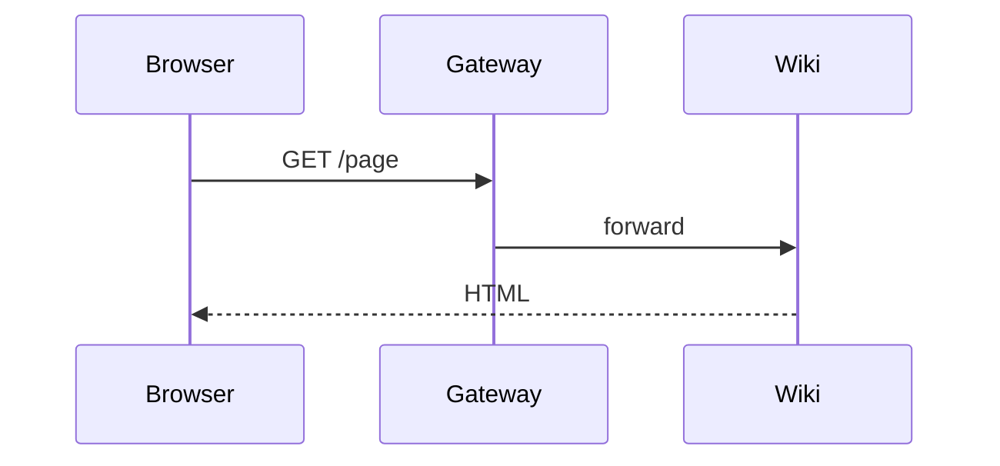

# Request flow

The request goes through the gateway first.

```mermaid
sequenceDiagram
  Browser->>Gateway: GET /page
  Gateway->>Wiki: forward
  Wiki-->>Browser: HTML
```

The same flow in Azure DevOps syntax:

::: mermaid
graph LR
  A[Browser] --> B[Gateway]
  B --> C[Wiki]
:::

Text after the diagrams.
